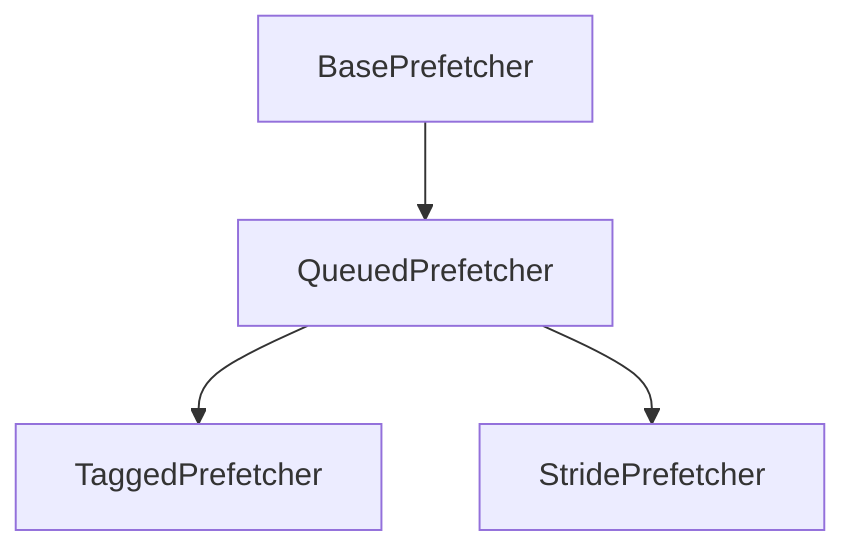

## Overview

DIR: `src/mem/cache/prefetch`

Related files:

```gfm
base.hh/cc
queued.hh/cc
tagged.hh/cc
stride.hh/cc
```

Basic class diagram (see `Prefetcher.py` for a quick view):



## BasePrefetcher

## QueuedPrefetcher

## TaggedPrefetcher

## StridePrefetcher

### Members

### Methods

```cpp
protected:
    bool pcTableHit(Addr pc, bool is_secure, int master_id, StrideEntry* &entry);
    StrideEntry* pcTableVictim(Addr pc, int master_id);
    Addr pcHash(Addr pc) const;
public:
    StridePrefetcher(const StridePrefetcherParams *p);
    void calculatePrefetch(const PacketPtr &pkt,
                           std::vector<AddrPriority> &addresses);
```

