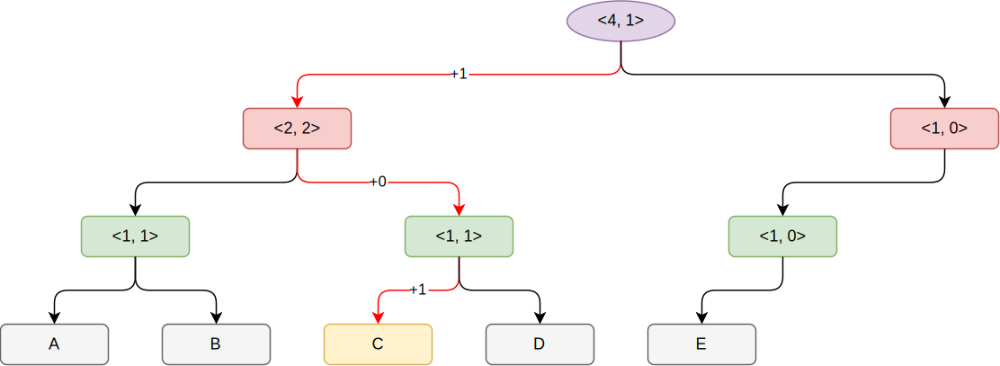
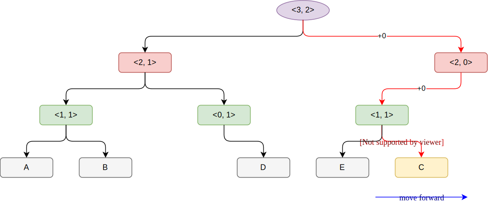

相关文件：

```gfm
mem/stack_dist_calc.hh
mem/stack_dist_calc.cc
```

重点：

第一种模式为使用stack结构，访问时数一下它在堆栈中的位置，复杂度为O(N)。如果不在堆栈中，那么dist视为Infinity。

示例（访问元素C前后）：


第二种模式为使用tree结构，真实数据保存在叶子节点（leaf node），对应的layer为0。其余的中间节点及root节点用于串接。`Node`有两个元素比较重要，`sumLeft`与`sumRight`，用来记录左右子树的大小（即叶子节点数量）。叶子节点的sumLeft设置为1，sumRight为0。所有最底层的叶子节点从左到右看，与上面的堆栈从下往上看顺序是一样的。但注意，stack实现方式中，各个节点是紧挨着的，而tree实现方式中，相邻叶子节点不一定紧挨的，中间可能有空缺，而且，每次访问hit之后，老节点从树中删除，然后生成新节点放到叶子层最右端，从而原来的老节点就成了空缺。如果中间节点没有了孩子，那么可能被清除。

计算叶子节点的位置，只需要统计位于它右侧的叶子节点数量。统计方式很简单，一直上溯到根节点（递归）累加。如果当前节点是父节点的左孩子，那么dist需要加上`parent->sumRight`；如果是右孩子，那么不需要改动。

示例，访问C之前，对应上图左侧：



注意图中是如何标记计算C的stack dist，有两次+1，所以dist为2。

访问C之后，删除C，并重新生成C放到节点E之后：



注意，新节点的产生总是往右增长的。如果节点D被访问了，那么它的父节点的sum变为0，可以清除了。